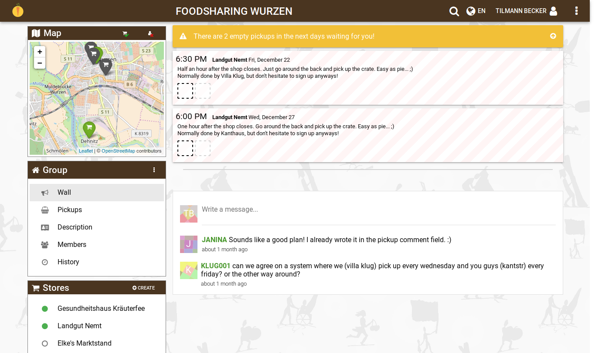

# karrot

Welcome to _karrot_! _karrot_ is a software to support foodsaving groups worldwide. A live deploy can be used on [karrot.world](https://karrot.world).

## foodsaving worldwide

The [foodsaving worldwide team](https://yunity.atlassian.net/wiki/display/FSINT/) provides additional resources to build up foodsaving.

## Development goals

Our current development goals are prioritized and written down in our [elaborate roadmap](ROADMAP.md).

We are keeping the features down to a minimum, in order to progressively build up a useful software.

## Releases

Look into our [change log file](CHANGELOG.md) for a quick overview of past versions and recent changes.

### Potential users

Have a look [on the live site](https://karrot.world) for all groups that have registered so far. Not all of them are using the app right now, but we have received feature requests from them.

## Translation

We are using [Transifex](https://www.transifex.com/) to provide _karrot_ in many languages. To help us with translation, please [create an account](http://transifex.com/signup) and [apply for the _karrot_ group](https://www.transifex.com/yunity-1/karrot/frontend/).

After selecting your destination language and choosing the resource file, go ahead to start translating!