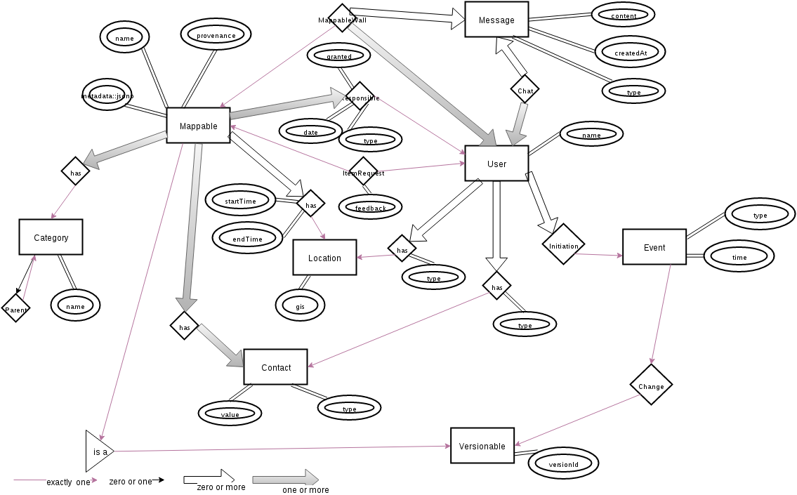

[](https://waffle.io/yunity/yunity-core)
[](https://waffle.io/yunity/yunity-core)
[](https://waffle.io/yunity/yunity-core)

# yunity
Hello Yunity!

## Getting started

### Install Pycharm
- wget https://download.jetbrains.com/python/pycharm-professional-4.5.4.tar.gz
- tar xf pycharm-professional-4.5.4.tar.gz
- ./pycharm-4.5.4/bin/pycharm.sh

### Install Redis
- use your packet manager to install the Redis server: apt-get install redis-server or pacman -S redis
- configure redis accordingly

### Install Elasticsearch
- e.g. OS X: `brew install elasticsearch`
- `elasticsearch` to run the server

if you get "low disk watermark" errors after some time, create a config .yml file (e.g. `~/.elasticsearch.yml` with the following contents:

```yml
cluster:
    routing:
      allocation:
        disk:
          threshold_enabled: false
```

Then invoke the server like so: `elasticsearch -Des.config="~/.elasticsearch.yml"``

### Create the environment
- git clone git@github.com:yunity/yunity.git ~/yunity
- sudo yum install vlc python3 python3-devel python-virtualenv
- virtualenv --python=python3 --no-site-packages ~/yunity/env
- source ~/yunity/env/bin/activate
- pip install -r ~/yunity/requirements.pip
- find ~/yunity/scripts/git-hooks/ -type f -exec ln -s {} .git/hooks \;

### Start the Crossbar.io realtime communication server
Enables real time push messages from server to client
- cd ~/yunity
- crossbar startyunity/models.py

### Run the project
- charm ~/yunity
- Set the project interpreter to ~/yunity/env/bin/python
- Run yunity (Shift+F10)

## Architecture

### Data model

[](https://drive.google.com/file/d/0B-3d76NgOlSSdk9VYVNWUWdBUEk/view)

## Settings

In development, you can add and override local settings in
`wuppdays/local_settings.py`, which is present in `.gitignore` and hence out of
version control. If the file is not present, i.e. in production, nothing
happens.
