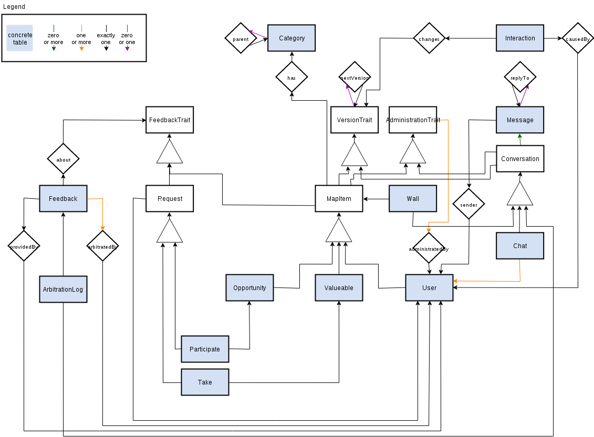

[](https://waffle.io/yunity/yunity)
[](https://waffle.io/yunity/yunity)
[](https://waffle.io/yunity/yunity)

# yunity-core

## Getting started
For a very quick startup, please checkout the [yunity-setup Repo](https://github.com/yunity/yunity-setup). Alternatively, the following steps allow a manual installation.

### Install system dependencies
- Python: python3 python3-devel python-virtualenv
- Databases: postgresql postgresql-devel redis [elasticsearch](https://www.elastic.co/guide/en/elasticsearch/reference/1.4/setup-repositories.html)
- Real-time: gcc libffi-devel python-devel openssl-devel
- Push-hooks: vlc
- Code style: pep8

Requires Python 3.5 as of 2015-11-17 TracebackException utility is used.

### Install Pycharm
- wget https://download.jetbrains.com/python/pycharm-professional-4.5.4.tar.gz
- tar xf pycharm-professional-4.5.4.tar.gz
- ./pycharm-4.5.4/bin/pycharm.sh

### Create the environment
- git clone git@github.com:yunity/yunity-core.git ~/yunity-core
- mkdir -p ~/virtualenvs/yunity-core
- virtualenv --python=python3 --no-site-packages ~/virtualenvs/yunity-core
- source ~/virtualenvs/yunity-core/bin/activate
- pip install -r ~/yunity-core/requirements.txt
- To take a git commit image, decide between VLC or fswebcam:
  - ln -rs yunity/management/scripts/git-hooks/picture-vlc .git/hooks/pre-push
  - ln -rs yunity/management/scripts/git-hooks/picture-fswebcam .git/hooks/pre-push

### Setup the servers

#### ElasticSearch
If you get "low disk watermark" errors from ElasticSearch, start elasticsearch as follows:

- elasticsearch -Des.config="config/elasticsearch.yml"

#### Postgres
- sudo -iu postgres
- initdb -D /var/lib/pgsql/data -E utf8
- createuser -s yunity-user
- createdb yunity-database

Add the connection to your local Postgres database server to `wuppdays/local_settings.py`.

```
DATABASES = {
    'default': {
        'ENGINE': 'django.db.backends.postgresql',
        'NAME': 'yunity-database',
        'USER': 'yunity-user',
        'PASSWORD': '',
        'HOST': '127.0.0.1',
        'PORT': '5432',
    }
}
```

If you get a "virtual memory error" with any of the postgres commands, close PyCharm and re-issue your command.


### Start the servers
- Start Elasticsearch: sudo /etc/init.d/elasticsearch start
- Start Redis: redis-server
- Start Postgres: postgres -D /var/lib/pgsql/data

### Run the project
- charm ~/yunity-core
- Set the project interpreter to ~/virtualenvs/yunity-core/bin/python
- Run yunity-core (Shift+F10)

If a migration fails with a error message, similar to `django.db.utils.ProgrammingError: column "id" referenced in foreign key constraint does not exist`, run the command `./manage.py reset_db`, followed by `./manage.py reset_db` to reset the database.

## Architecture

### Data model

[](yunity/doc/yunity-schema.xml)

## API Documentation

A swagger description file is generated at /doc. You can pass it to any swagger installation.

### Install swagger locally

See the yunity-setup repository [] for a complete local environment that also includes a swagger release.

## Django application settings

In development, you can add and override local settings in
`wuppdays/local_settings.py`, which is present in `.gitignore` and hence out of
version control. If the file is not present, i.e. in production, nothing
happens.

## Update requirement packages

pip-tools is used to manage requirements. To use the latest possible requirements, do:

- pip install pip-tools
- pip-compile

Use pip-compile -p to include prereleases.

## Contributing to yunity-core

To contribute, please get in contact with us. We want to follow a pull request / code review cycle as soon as possible but in our early design stages we prefer to work in teams at the same desk.
We use

- github issues for development tasks (try waffle.io for a nice view on it)
- [slack](https://yunity.slack.com) as team communication, not only for development

### Coding guidelines
We follow the pep8 with disabled whitespace checks and a wider maximum line length of 120 characters.
As always, the coding style may not apply at some parts.
You can execute yunity/management/scripts/git-hooks/pep8-check in the repository root.
