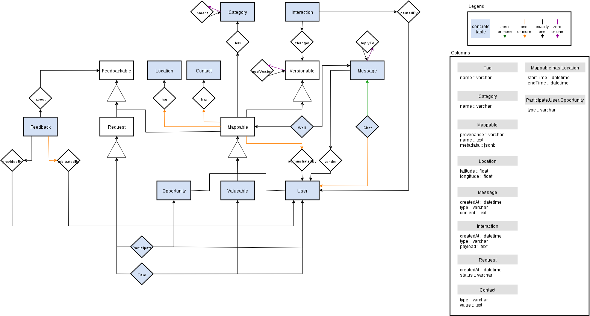

[](https://waffle.io/yunity/yunity-core)
[](https://waffle.io/yunity/yunity-core)
[](https://waffle.io/yunity/yunity-core)

# yunity-core

## Getting started

### Install system dependencies
- Python: python3 python3-devel python-virtualenv
- Databases: postgresql postgresql-devel redis [elasticsearch](https://www.elastic.co/guide/en/elasticsearch/reference/1.4/setup-repositories.html)
- Real-time: gcc libffi-devel python-devel openssl-devel
- Push-hooks: vlc

### Install Pycharm
- wget https://download.jetbrains.com/python/pycharm-professional-4.5.4.tar.gz
- tar xf pycharm-professional-4.5.4.tar.gz
- ./pycharm-4.5.4/bin/pycharm.sh

### Create the environment
- git clone git@github.com:yunity/yunity-core.git ~/yunity-core
- mkdir -p ~/virtualenvs/yunity-core
- virtualenv --python=python3 --no-site-packages ~/virtualenvs/yunity-core
- source ~/virtualenvs/yunity-core/bin/activate
- pip install -r ~/yunity-core/requirements.pip
- To push a git commit image, decide between VLC or fswebcam:
  - ln -rs scripts/git-hooks/picture-vlc .git/hooks/pre-push
  - ln -rs scripts/git-hooks/picture-fswebcam .git/hooks/pre-push

### Setup the servers

#### ElasticSearch
If you get "low disk watermark" errors from ElasticSearch, start elasticsearch as follows:
 
- elasticsearch -Des.config="config/elasticsearch.yml"

#### Crossbar
If you need to modify the crossbar ip/port settings, copy `config/crossbar.json` to a local `.crossbar/config_local.json` and run

- crossbar start --config config_server.json

(the .crossbar path is automatically prepended)

#### Postgres
- sudo -iu postgres
- initdb -D /var/lib/pgsql/data -E utf8
- createuser -s yunity-user
- createdb yunity-database

Add the connection to your local Postgres database server to `wuppdays/local_settings.py`.

```
DATABASES = {
    'default': {
        'ENGINE': 'django.db.backends.postgresql',
        'NAME': 'yunity-database',
        'USER': 'yunity-user',
        'PASSWORD': '',
        'HOST': '127.0.0.1',
        'PORT': '5432',
    }
}
```

If you get a "virtual memory error" with any of the postgres commands, close PyCharm and re-issue your command.


### Start the servers
- Start Elasticsearch: sudo /etc/init.d/elasticsearch start
- Start Crossbar: cd ~/yunity-core; crossbar start
- Start Redis: redis-server
- Start Postgres: postgres -D /var/lib/pgsql/data

### Run the project
- charm ~/yunity-core
- Set the project interpreter to ~/virtualenvs/yunity-core/bin/python
- Run yunity-core (Shift+F10)

## Architecture

### Data model

[](documentation/yunity-schema.xml)

## API Documentation

A swagger description file is generated at /doc. You can pass it to any swagger installation.

### Install swagger locally

An easy swagger setup can be included into the django distribution. Add the following line to your local_settings.py

```
LOCAL_WEBAPP_PATH = 'path_to_/yunity-core/static'
```

and clone the swagger-ui repo there:

```
git clone https://github.com/swagger-api/swagger-ui.git
```

Now you can point your browser to the swagger index.html

```
localhost:8000:/swagger-ui/dist/index.html
```

just enter

```
http://localhost:8000/doc
```

and you can explore the API.

## Settings

In development, you can add and override local settings in
`wuppdays/local_settings.py`, which is present in `.gitignore` and hence out of
version control. If the file is not present, i.e. in production, nothing
happens.
