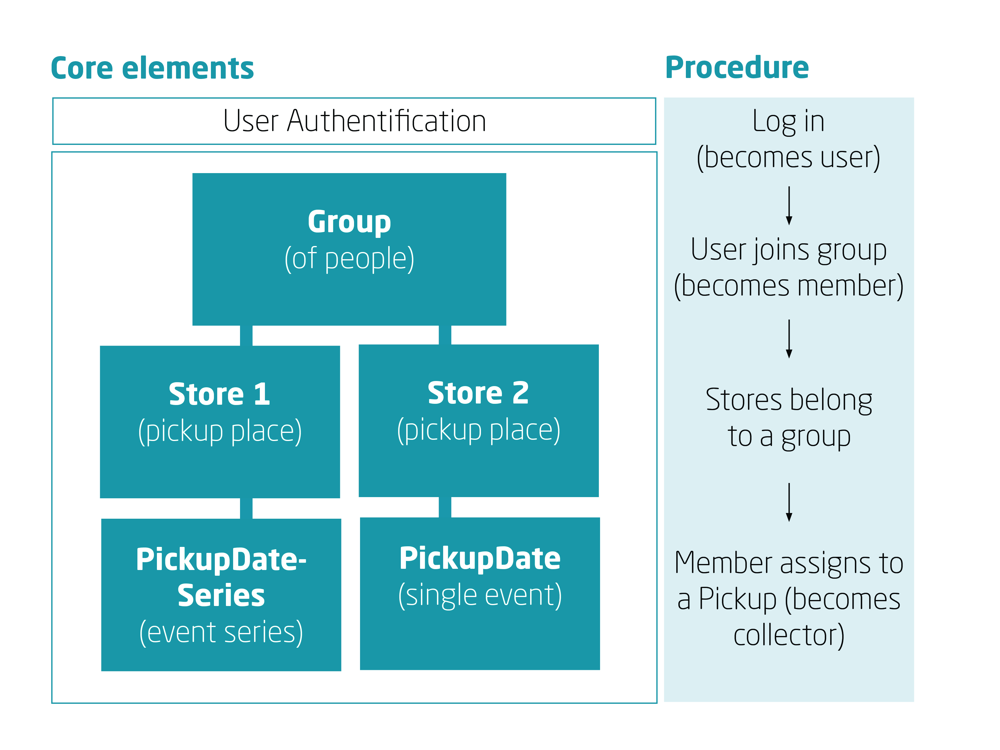

# foodsaving.world Beginners Guide

- Website: https://foodsaving.world
- Model predecessor: https://foodsharing.de
- Repository on GitHub: https://github.com/yunity/karrot-backend

This is a beginner guide to _karrot-backend_ by [@id-gue](https://github.com/id-gue) and [@mddemarie](https://github.com/mddemarie) written for people who want to contribute to foodsaving.world, but aren't (yet) experienced Python/Django devs. Welcome and have fun!

### Repository Structure

There are two separated Repos for Frontend and Backend.

**Karrot-Frontend in JavaScript**
https://github.com/yunity/karrot-frontend

You don't need to do the setup for the frontend, but it might be useful to try out your backend through the frontend.

**Karrot-Backend in Python Django REST**
https://github.com/yunity/karrot-backend

- Python – object-oriented programming language
- Django – Python framework (for faster web development)
         Tutorial: https://docs.djangoproject.com/en/1.11/intro/tutorial01
- Django REST Framework on top of django for building Web APIs
         Tutorial: http://www.django-rest-framework.org/tutorial/1-serialization

*Both repositories are not directly connected – the data exchange works via an API.*

## 01  Setup

We use Docker for the setup. How to build a Docker container is described in the README.md in the [karrot-backend repository](https://github.com/yunity/karrot-backend).

We would suggest to use __3 tabs in the shell__:

1. __Tab for Communicating with git / GitHub__ (doing that inside the docker container might raise errors)

2. __Tab with Docker running for run manage.py commands__

	Find out the name of your Docker Container: `docker ps`
	_(examples: `young_curie` or `amazing_lovelace`)_

	Run Docker with: `docker exec -it <container_name> bash`
	_(After starting Docker your lines in the shell start with: `(env)`)_

	Running __tests__:

	`python manage.py test`
	_(Please run the tests after your setup and every time you make a change in code.)_

	After changing a model you have to __migrate__ them:

	`python manage.py makemigrations`
	`python manage.py migrate`

	Leave Docker: `exit`

3. __Tab with Docker running to check what your server is doing__

	Show the last 12 lines of the server output:
	`docker logs -f <container_name> --tail "12"`

	_Note: The first line shown is an email address. Store it – we will need it for Swagger._

## 02 Project Architecture

### Relationships in Backend

First of all, you have to have a `Group` Model, allowing to create objects like "Foodsavers Berlin". One Group usually has many `Stores`, like "Bakery Smith". Each store can define events where foodsavers can come by and save food. These events are called `PickupDate` (one time event) or `PickupDateSeries` (repetitive event).

As logged-in user, you can create and join a Group, what makes you a `member`. Afterwards, you can join or create a PickupDate event which takes place in the future, what makes you a `collector`.

Further actions are for example:

- for member in `Group`: create/modify/join/leave
- for member in `Store`: create/update/delete
- for collector in `PickupDate`/`PickupDateSeries`: create/join/update/delete

Collectors have also an option after food pickup to leave a `feedback`.

### Foodsaving Apps

At the moment (September 2017) there are 15 Apps (= Folders) in foodsaving. Not all of them are in use or critical for [foodsaving.world](https://foodsaving.world/#!/landingPage) since the project is under development and the dev team tries different approaches.

Important apps are for example:

- `groups` (see above)
- `users` (user data and user profile, reset user password, change password etc.)
- `userauth` (login and logout)
- `base` (most models in the code inherit from the models created there)
- `tests` (the test coverage is very high - some of the tests are in the test app – others in the other apps)
- `stores` and `history` might need a bit more explanation:

#### Stores

In models.py in `stores`, you can find classes for Stores and Feedback, as well as PickupDate and PickupDateSeries. The last two refer to pickup-date and pickup-series in Swagger (see chapter "Server and Swagger") and contain appropriate data fields. `PickupDateManager` with the method `process_finished_pickup_dates` is an interesting class because it processes old pickups and moves them into `history` (even empty ones) - as a result you find `PICKUP_MISSED` or `PICKUP_DONE` in the database.

#### History

In `history` you find any action regarding stores, groups or pickup-dates/pickup-series from the past. As result you find here different HistoryTypus (just “typus” in database), e.g. PICKUP_JOIN and additional data about that action. This helps to keep a track of all actions.

## 03 Stores app in detail

We want to dig a bit deeper in the app stores a) to give you an example how the foodsaving apps work and b) because there is too much functionality inside that you might like to know. If you didn't already opened the code in your editor: do it now! Open the stores app and have a look on the files:

1. __models.py__ Here you define which database tables you want to have and what the fields/columns should store in the database. One model (or class) defines one database table. Let's have a look on the Model `Feedback` which creates four database fields (and two fields for the id and a time stamp, but these are created automatically here). The following line creates a field with the name `comment`.

	`comment = models.CharField(max_length=settings.DESCRIPTION_MAX_LENGTH, blank=True)`

	The type [CharField](https://docs.djangoproject.com/en/1.11/ref/models/fields/#django.db.models.CharField) says that `comment` will be stored as string in database. That string could be maximal as long as defined in the file settings.py under `DESCRIPTION_MAX_LENGTH`. The entry can be saved even if the comment field is `blank`.

2. __serializers.py__ The models we created in models.py are python objects. But these are not very useful in order to access the API – so we convert them to JSON objects with `serializers`. Our Feedback model has a FeedbackSerialzer which inherits many functions from ModelSerializers. But there are also new functions like `validate_about`. (user is a member of group, that member joined the pickup and the pickup is in the future).  This validator checks if a user is allowed to give feedback about a certain pickup. _(Validate stuff in a Serializer might sound strange, but it's common in the REST framework. See [Validators in the documentation](http://www.django-rest-framework.org/api-guide/validators/))_

3. __permissions.py__ Another possibility to check if something is allowed are _permissions_. They are used in `api.py`. Here is for example the permission `IsNotFull` that permits a member to join the pickup event only if it is not full.

4. __api.py__ The api defines how the data stored in the database can be accessed via API. The used HTTP methods (like `GET`, `POST` or `PATCH`) are described in the chapter _03 Server and Swagger_.

	Instead of normal `Views` we use whole `ViewSets` which allow to combine the logic for a set of related views. Have a look on the class `FeedbackViewSet`. You will notice that most HTTP methods (like `GET`) are not defined there but in an imported [mixin](http://www.django-rest-framework.org/api-guide/generic-views/#mixins). Each mixin contains whole logic for creating a single HTTP request. The ViewSets are connected with `urls.py` and defined there in form of an url.

5. __factories.py__ In a Factory you can create sample data used in the tests.

6. A folder with __tests__ The test coverage of the project is very good and [Circle CI](https://circleci.com/) will answer in angry red if you try to push untested or non-functioning code.

	Have a look on the class FeedbackTest in `test_feedback_api.py`. First we create all data we need in the setUpClass we are going to use in our tests. Then we test step by step if the expected result is `assertEqual` to the actual result. _(The chapter '01 Setup' explains how to run the tests in the shell.)_

7. A folder with __migrations__: You don't have to care about them a lot here. They are generated automatically when you run `python manage.py makemigrations` in the shell with Docker active.

Please also have a look on the used urls in _config/urls.py_ and on the archive functions in _foodsaving/history_.

## 04 Server and Swagger

#### Why do you need the server output in the shell?

On one hand it's good to notice when the server is not running anymore (to avoid errors), on the other hand you can display with some sample data in Swagger and better understand relations between models.

Furthermore, you see an automatically generated mail address when you start running you docker container (see 3. Tap of "Setup"). Use this and the password `123` to login to Swagger in your browser:

http://127.0.0.1:8000/docs/

#### Why Swagger?

[Swagger](https://swagger.io/docs/specification/about/) shows you the API endpoints that are defined in the _api.py_ files in the apps groups, stores etc. One of the API endpoint is `pickup-dates`.

You can use [HTTP methods](https://developer.mozilla.org/en-US/docs/Web/HTTP/Methods) like:

* **GET**: list all data from database
* **POST**: submits new entry into database
* **PATCH**: modifies one entry in database based on given id
* **DELETE**: deletes one entry from database based on gived id

You can also add additional functionalities to your API endpoint like:

* **GET /api/..../{id}/**: displays one entry from database based on given (e.g. pickup-date) id
* **POST /api/..../{join}/**: the user/member joins the group/store/pickup
* **POST /api/..../{leave}/**: the user/member can leave the group/store/pickup
* any other functionality added to **GET**, **POST**, **PATCH** or **DELETE**

The Database is automatically populated with sample data if you use Docker. But there are missing connections between: being user -> being member -> being collector -> pick up the food. You can create these connections in Swagger for testing purposes.

> **TIP**: If you want, you can populate first the database writting some [querysets](https://docs.djangoproject.com/en/1.11/topics/db/queries/) in Django Shell and then look it up in Swagger. Or you can [open PostgreSQL](https://www.postgresql.org/docs/8.3/static/tutorial-accessdb.html) and populate the database there.

#### Response-request Cycle

Whenever you paste the url http://127.0.0.1:8000/docs/ into a browser and hit Enter, you send a request to your local server sitting on your computer (live web sites have their own host server with a domain). It depends if you want to GET data or POST data. The server (with own IP address) will use the given URL (with own IP address), execute some functionality on server with usage of data in database and will respond with view that you can see in your browser.

## 05 Tests

Every time you run the tests (like described in the chapter _Setup_), an additional test database gets created. After the tests are done, it gets deleted. It is not connected to the database you use in Swagger. Therefore, we need to populate it for testing new functionality.

The common structure of the tests is:

- Every class in the _models.py_, _api.py_ and _filters.py_ has a class with tests
	(e.g. the class _FeedbackViewSet_ in the file _api.py_ gets tested in the class _FeedbackTest_ in the file _test–feedback–api.py_)
- The test class begins with a _setUpClass_. Here the database gets populated. Therefore, you can use:
	a) a _Factory_ (like the _member_ in _FeedbackTest_ which gets created in the UserFactory) or
	b) you create the needed objects directly (like _feedback_) with querysets
- Every test case should have its own function below SetUpClass to make bug fixing in the future easier

In the project, there are 2 types of tests:

**1. Integration tests** - test not only one class/function in a file but whole functionality of one part of the project, e.g. based on test case in the FeedbackTest in the file test-feedback-api.py, we cannot know if the test wants us to add a code to FeedbackViewSet or FeedbackSerializer (`api.py` or `serializers.py`).

**2. Unit tests** - test only one function/class in file, e.g. the model Feedback will be tested in test-models.py and the test cases will test each field in model.
